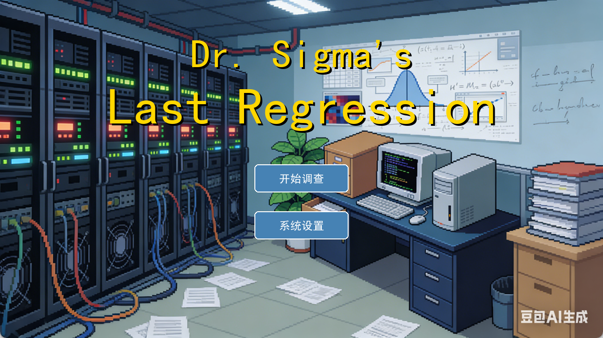
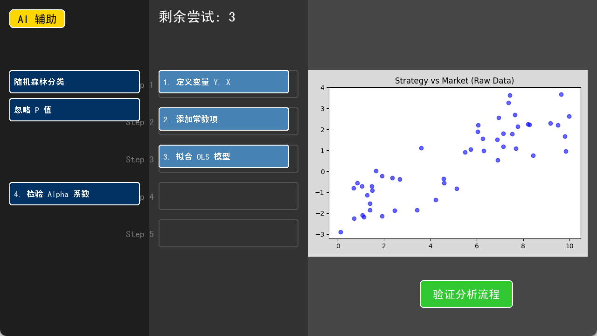

# Mr-Sigema-Last-Regression
本项目是一款结合侦探叙事与数理统计的 Python 解密游戏。玩家将扮演一名精通数据的私家侦探，调查顶级量化基金首席科学家 Dr. Sigma 的离奇死亡案。不同于传统搜证，你需要运用线性回归、假设检验、多重共线性分析及时间序列预测等统计学方法，从杂乱的金融数据中修正模型、还原真相，最终揭露隐藏在算法背后的巨大阴谋。

---

# 🕵️‍♂️ Dr. Sigma's Last Regression | Dr. Sigma 的最后回归

> **Data Never Lies, But People Do.**  
> **数据从不说谎，但人会。**

  

## 📖 简介 (Introduction)

**Dr. Sigma's Last Regression** 是一款结合了**黑色侦探叙事 (Noir Detective Narrative)** 与 **数理统计 (Statistical Methodology)** 的沉浸式解密游戏。

顶级量化对冲基金 "AlphaGo Capital" 的首席科学家 Dr. Sigma 在办公室离奇死亡。作为一名精通数据的私家侦探，你需要深入他的遗产——一系列加密的 `.csv` 金融数据。不同于传统的搜证游戏，你的武器不是放大镜，而是**线性回归**、**假设检验**和**时间序列分析**。

**Dr. Sigma's Last Regression** is an immersive puzzle game that blends **detective storytelling** with **statistical analysis**. You play as a data-savvy private investigator probing the suspicious death of a top quantitative scientist. Instead of traditional clues, you must use **Linear Regression**, **Hypothesis Testing**, and **Time Series Analysis** to uncover the conspiracy hidden within the financial data.

## ✨ 游戏特色 (Features)

*   **沉浸式剧情**: 体验跌宕起伏的金融犯罪故事，揭开华尔街光鲜亮丽背后的阴谋。
*   **硬核统计学**: 游戏机制基于真实的统计学原理。你需要清洗数据、修正模型异方差、消除多重共线性。
*   **动态可视化**: 利用 `Matplotlib` 实时生成数据图表，所见即所得。
*   **交互式解密**: 通过拖拽拼图的方式构建统计分析步骤，错误的操作将导致模型失效。
*   **AI 辅助系统**: 内置模拟 AI 助手，随时解答统计学名词（支持 Ctrl+V 粘贴 API Key）。

## 📚 章节与知识点 (Syllabus)

玩家将在破案过程中逐步掌握以下统计学方法：

| 章节 (Chapter) | 剧情线索 (Story Clue) | 统计方法 (Statistical Method) | 核心概念 (Key Concepts) |
| :--- | :--- | :--- | :--- |
| **Ch 1** | 线性的谎言 | **OLS 线性回归** | $R^2$, P-Value, 截距项 (Alpha) |
| **Ch 2** | 共线性的迷雾 | **VIF 检验** | 多重共线性, 变量剔除 |
| **Ch 3** | 嫌疑人的对抗 | **独立样本 T 检验** | 均值差异, 显著性水平 |
| **Ch 4** | 不均匀的罪证 | **加权最小二乘法 (WLS)** | 异方差性 (Heteroscedasticity), 残差分析 |
| **Ch 5** | 时间的预言 | **ARIMA 模型** | 时间序列, 自相关, 差分, 预测 |

## 🛠️ 安装与运行 (Installation)

### 1. 环境准备 (Prerequisites)
确保您的电脑已安装 **Python 3.8** 或更高版本。

### 2. 下载源码 (Clone/Download)
下载本项目到本地文件夹。

### 3. 安装依赖 (Install Dependencies)
在项目根目录下打开终端或命令行，运行：

```bash
pip install pygame matplotlib numpy
```

### 4. 目录结构检查 (Directory Structure)
请确保您的文件结构如下所示，**`assets` 文件夹及其内容是必须的**：

```text
Project_Root/
├── main03.py                # 游戏主程序
├── README.md              # 说明文档
├── simhei.ttf             # (可选) 中文字体，防止乱码
└── assets/                # 素材文件夹
    ├── bg_menu.jpg        # 菜单背景
    ├── bg_settings.jpg    # 设置背景
    ├── bg_crime_scene.jpg # 现场背景
    ├── bg_desktop.png     # 桌面背景
    ├── bg_office.jpg      # 对话背景
    ├── bg_server.jpg      # 机房背景
    ├── char_detective.png # 侦探立绘
    ├── char_assistant.png # 助手立绘
    └── char_suspect.png   # 嫌疑人立绘
```

### 5. 开始游戏 (Run)
```bash
python main03.py
```

## 🎮 操作说明 (Controls)

*   **鼠标左键**: 点击选项、拖拽解密卡片、推进剧情对话。
*   **键盘输入**: 在设置界面输入 API Key 或在 AI 对话框输入问题。
*   **Ctrl + V**: 在输入框中粘贴文本（推荐）。

## 🖼️ 游戏截图 (Screenshots)
 

## 🤝 贡献 (Contributing)

欢迎提交 Issue 或 Pull Request 来改进剧情文本或增加新的统计学关卡！

## ❤ 致谢
灵感来源于**华东师范大学 颜廷进老师 计量经济学课程**

颜老师上课讲述统计学知识层层递进，用解决问题的方式引出新的模型，让我受益良多，这也给本游戏的玩法提供了很多参考和启发。
